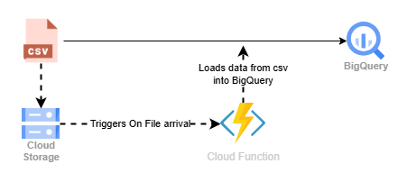
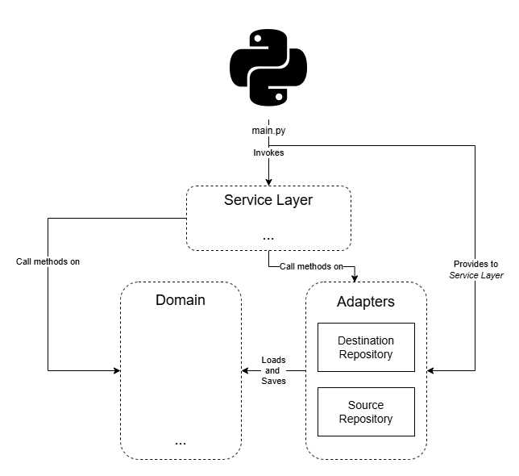
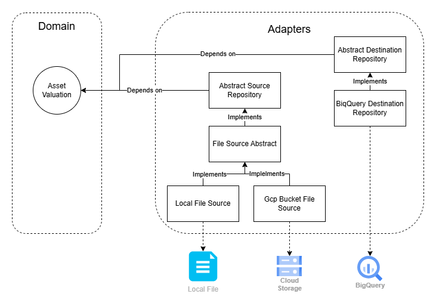

# Asset-valuation-ingestion
## Overview

This repository provides a solution for ingesting Asset Valuation data from files into a Data Warehouse (DW) layer. The current implementation supports parsing data from Generic and Hargreaves Lansdown file sources, whether stored locally or in a Google Cloud Platform (GCP) bucket. The ingested data is then stored in BigQuery. This repository includes tools, pipelines, and configurations designed to streamline the ingestion process while ensuring scalability and maintainability.

The solution is deployed using Terraform as a Google Cloud Function. This function is triggered whenever a file is uploaded to a specified GCP bucket. Upon activation, the function processes the CSV file and loads its data into BigQuery. See picture below.

|   |
|:----------------------------:|

## Features

- **Development Environment**: Pre-configured development container for consistent setup.
- **Comprehensive Testing**: Includes unit tests and integration tests to ensure code reliability, along with test coverage reporting.
- **Pipeline Integration**: Automated pipelines to unit test python solution and deployment to GCP.


## Development environment

Recommended development enviroment is VSCode Dev Containers extension. The configuration and set up of this dev container is already defined in `.devcontainer/devcontainer.json` so setting up a new containerised dev environment on your machine is straight-forward.

Pre-requisites:
- docker installed on your machine and available on your `PATH`
- [Visual Studio Code](https://code.visualstudio.com/) (VSCode) installed on your machine
- [Dev Containers](https://marketplace.visualstudio.com/items?itemName=ms-vscode-remote.remote-containers) vscode extension installed

Steps:
- In VSCode go to `View -> Command Pallet` and search for the command `>Dev Containers: Rebuild and Reopen in Container`

The first time you open the workspace within the container it'll take a few minutes to build the container, setup the virtual env and then login to gcloud. At the end of this process you will be presented with a url and asked to provide an authorization. Simply follow the url, permit the access and copy the auth code provided at the end back into to the terminal and press enter. 

### Configure Git 

For seamless Git usage in a Dev Container, create a local script at .devcontainer/git_config.sh (do not push this file to the repository) and set your GitHub account name and email:

```bash
#!/bin/bash

git config --global user.name "your github account name"
git config --global user.email "your github account email"
```

### Local Execution

To execute the solution, use the following command in a Bash terminal `asset-valuation-ingestion` inside the devcontainer. Executing this command will prompt a message providing the available arguments to perform different actions. You can explore additional details and options by using the --help tag.

you need to provide a `.env` file at project root location with the following data:

```ini
PROJECT={name of GCP Project}
```

### Unit tests

To execute tests, provide a `tests/.env` file with the following data:

```ini
PROJECT={name of GCP Project}
SOURCE_BUCKET={If file in GCP Bucket, name of bucket}
DESTINATION_TABLE={name of destination table in BQ}
DATASET={name of destination dataset in BQ}
```

execute the following command in terminal to ensur:

```bash
python -m pytest -vv --cov --cov-report=html
```

Unit testing has been integrated into the CI/CD pipeline. A merge will not be approved unless all tests pass successfully. Additionally, a coverage report is automatically generated and provided as a comment for reference.

## Component Diagram

The code architecture of the Python solution is illustrated below. We adopt Onion/Clean Architecture, so ensuring that our Business Logic (Domain Model) has no dependencies. Our goal is to follow SOLID principles, promoting seamless future changes and enhancing code clarity.

The `src/entrypoints/cloud_function/main.py` file is used by the deployed solution as entrypoint, as required by GCP Cloud Functions. Locally, as described in the "Local Execution" section, code execution starts from the Python entrypoint located at `src/entrypoints/cli/__main__.py`. This entrypoint is invoked using the command `asset-valuation-ingestion` in a Bash terminal. 

Several entry points can be provided seamlessly because, following Clean Architecture principles, the `main.py` function is treated as the last detail. This ensures that none of the core solution code depends on the entry point; instead, the entry point depends on the core solution code. This design promotes flexibility and allows for the easy addition of new entry points without impacting the existing architecture. Which, in turn, means that the source is independent of the infrastructure. 

The Python entrypoint invokes one of the services found in `src/services.py`. In this case we have only the Asset Valuation pipeline. This service receive objects of the clients for both the destination repository and the source repository as parameters.

The services handle the execution by calling methods found in the Domain and Adapters to ensure the successful completion of the process.

|  |
|:----------------------------:|

The clients for data storage have been implemented following the Repository pattern. This design pattern abstracts the logic for retrieving and storing data, providing a higher-level interface to the rest of the application. By doing so, it enables the implementation of the Dependency Inversion Principle (DIP). This approach allows our Database Layer (Adapters) to depend on the Domain Model, rather than the other way around. This, in turn, facilitates the seamless use of the same Business Logic/Domain Model in another scenario with a different Infrastructure/Data Layer.

Related code can be found on `src/destination_repository.py` and `src/source_repository.py`.

|  |
|:----------------------------:|

In the picture above you can also find the Domain Model diagram representing the code found in `src/model` folder. Circles are value objects and rectangles are entities.

## CI/CD - Pipeline Integration
There are 2 CI/CD pipelines implemented as GitHub Actions:

1. **Pytest**: This pipeline is defined in the `.github/workflows/pytest.yaml` file. It is triggered on every pull request, what runs unit tests using `pytest`. It also generates a test coverage report to ensure code quality. If any test fails, the pipeline will block the merge process, ensuring that only reliable code is integrated into the main branch. Finally, the pipeline requiress a pytest coverage over a given threshold.
2. **Deployment**: The deployment process is managed through two GitHub Actions workflows. The first workflow, `.github/workflows/terraform-validate.yaml`, validates the Terraform code and generates a deployment plan during a pull request, blocking merge in case of failures. The second workflow, `.github/workflows/terraform-apply.yaml`, executes after a merge to deploy the changes to Google Cloud Platform (GCP).

## Deployment implementation

The Terraform code in this repository automates the deployment of the Asset Valuation ingestion solution on Google Cloud Platform (GCP). It provisions and configures the necessary resources to ensure seamless ingestion and processing of data. 

Terraform code handles uploading the source code zip file to the designated Cloud Function Source Code bucket and creating the Cloud Function itself.

### Considerations

The Terraform code is designed to be executed by the workflows defined in `.github/workflows/terraform-validate.yaml` and `.github/workflows/terraform-apply.yaml`. These workflows first package the source code into a zip file, which is then used as the source code for the Cloud Function during the Terraform execution.

If you prefer to execute the Terraform code locally, you must first run the `.github/package_cfsrc.sh`* bash script. This script packages the source code into a zip file. Once the zip file is created, you can proceed with running `terraform plan` or `terraform apply`, providing the name of the zip file.

A final consideration is that the backend for this solution is configured to reside in Google Cloud Storage (GCS). If you plan to reuse this code, ensure you update the backend bucket name accordingly.

**This file must be executed at repo root folder.*

### Prerequisites for Terraform Execution

Before the Terraform code can be executed, ensure the following:

1. **Default Cloud Storage Service Account**:
    - Assign the `_roles/pubsub.publisher_` role to your Default Cloud Storage Service Account.

2. **Cloud Function Service Account**:
    - Provide a Service Account for the Cloud Function with the following roles:
      - `_roles/bigquery.dataEditor_`
      - `_roles/bigquery.jobUser_`
      - `_roles/run.invoker_`
      - `_roles/eventarc.eventReceiver_`
      - `_roles/storage.objectViewer_` on the _raw assets_ bucket.

3. **Terraform Execution Permissions**:
    - Either your user account or the Service Account used to run the Terraform code must have the following roles:
      - `_roles/iam.serviceAccountUser_` on the Service Account mentioned in the previous point.
      - `_roles/eventarc.admin_`
      - `_roles/cloudfunctions.admin_`
      - `_roles/storage.objectAdmin_` on the _raw assets_, _source code_, and _backend_ buckets.
      - `_roles/storage.insightsCollectorService_`

To reuse the GitHub Action, follow these steps:

1. **Create a Workload Identity Provider (WIP):**  
   This enables keyless authentication for GitHub Actions.  
   - [Learn why this is needed](https://cloud.google.com/blog/products/identity-security/enabling-keyless-authentication-from-github-actions).  
   - [Follow these instructions](https://docs.github.com/en/actions/security-for-github-actions/security-hardening-your-deployments/configuring-openid-connect-in-google-cloud-platform).

2. **Set up Service Account:**  
   - Grant the Terraform Executor Service Account the necessary permissions to execute Terraform code as indicated before.
   - Assign the role `roles/iam.workloadIdentityUser`.
   - Set the Service Account as the principal for the Workload Identity Provider created in step 1.